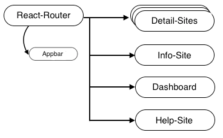
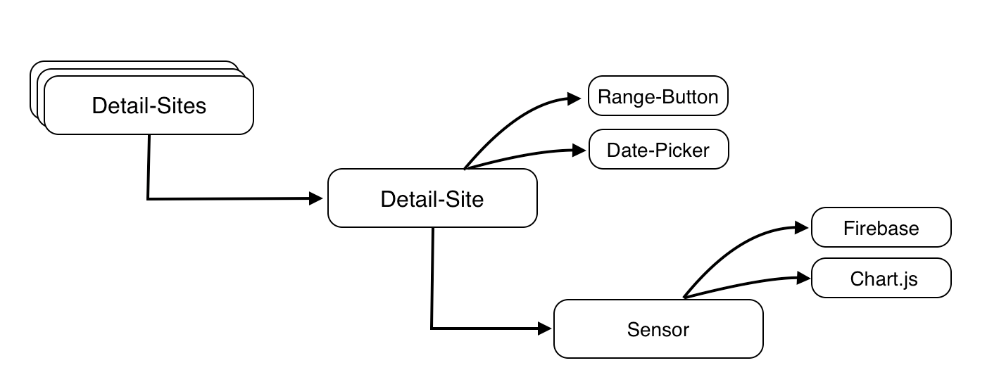

# Structure of this project

## Routing
[React-Router](https://www.npmjs.com/package/react-router) implements the whole routing and authentication.

React-Router only allows authenticated users to visit sites where authentication is needed. If unauthenticated users try to visit these sites they get redirected to the login page. On the other Hand if authenticated users try to visit sites where you need to be unauthenticated, like the login page, they get redirected to the dashboard.

## Authentication
The Authentication is implemented with [Firebase’ Custom Authentication System](https://firebase.google.com/docs/auth/web/custom-auth).

## Design

The whole Project is done with [Material-UI](http://www.material-ui.com/#/).


## Sites
The Project consists of these sites:
```..*Unauthenticated/
		...*./loginPage
	
..*Authenticated/
		...*./dashboard
		...*./detailPage (Perf | PH | Rain | Rpm | Temp | WaterTemp | 							WindDir | WindSpeed | WL)
		...*./help
		...*./info
	
```

## Dashboard
The Dashboard consists of multiple instances of [_sensor.js](../src/ui/components/sensors/_sensor.js) with an associated [RaisedButton](http://www.material-ui.com/#/components/raised-button) with directs to the associated detail site.

## Detail sites
Detail sites consist of one instance of [_sensor.js](../src/ui/components/sensors/_sensor.js) and a [dropout button](../src/ui/components/generic/_dropoutButton.js) to set time ranges.

All detail sites are calling a [generic class](../src/ui/components/generic/_detailPage.js). This calls the correct associated sensor, which fetches the correct associated data.


